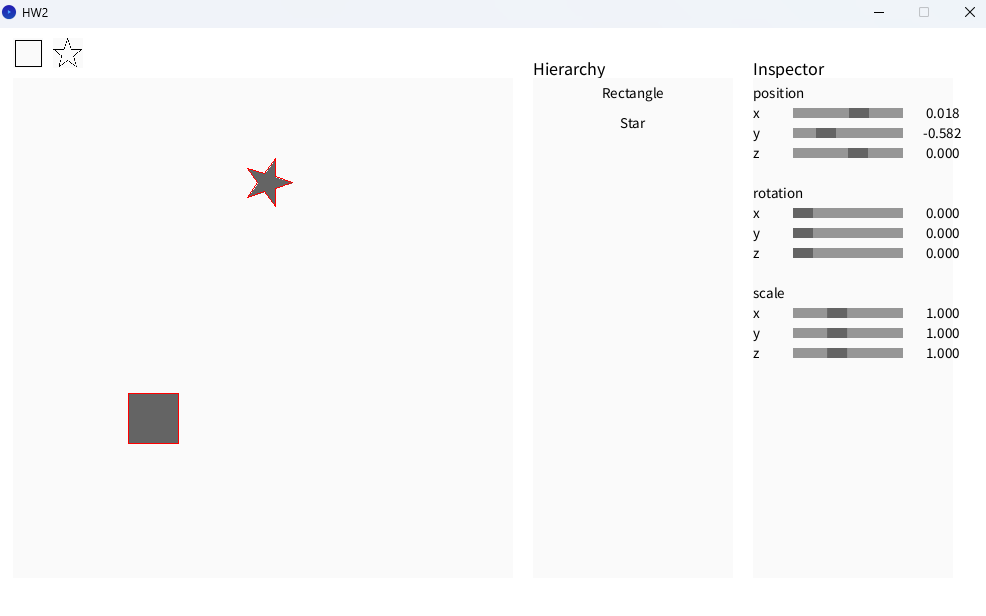
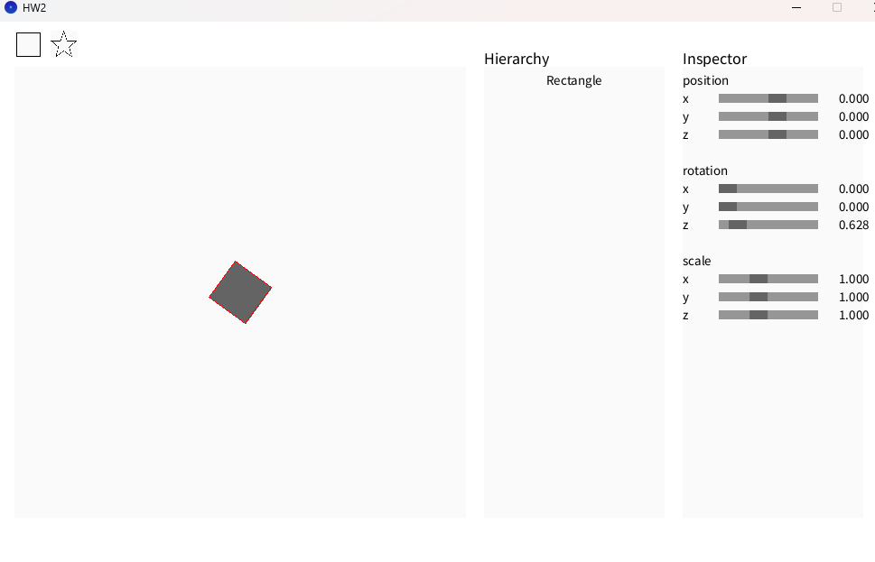
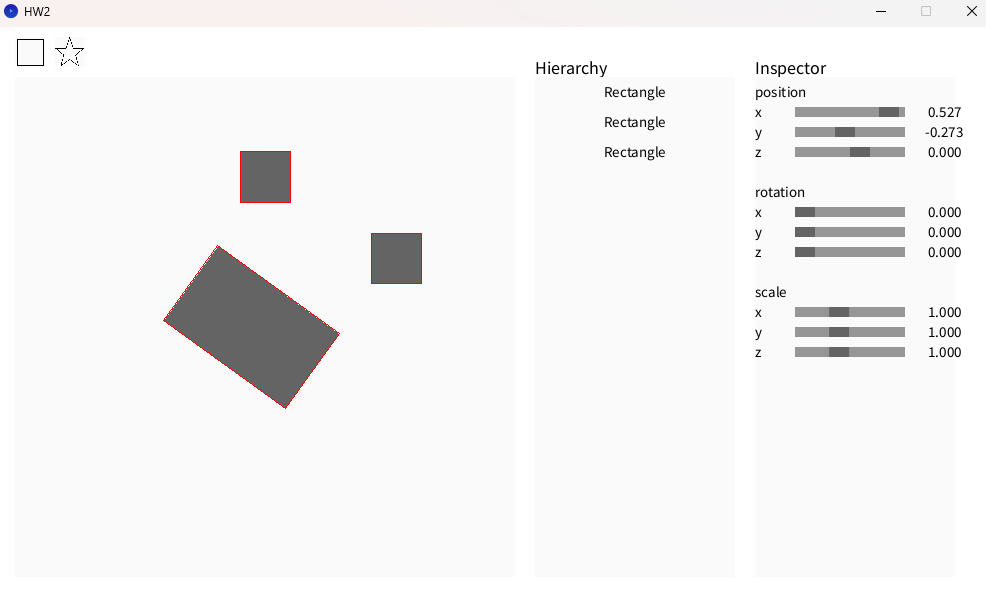
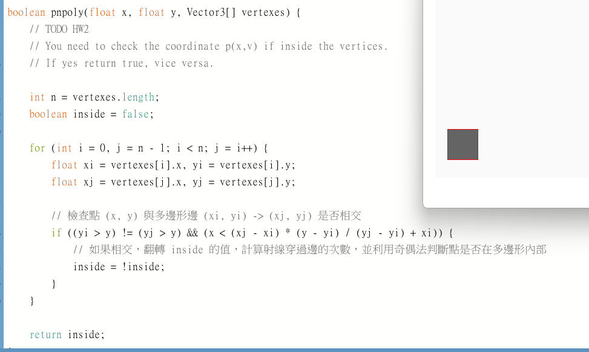
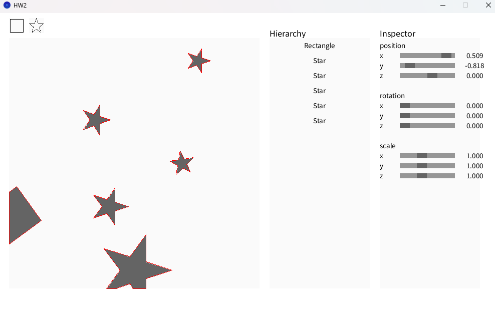

# CG Assignments - Lab 1

## 我的任務清單
- [O] Translation Matrix
- [O] Rotation Matrix (Z-axis)
- [O] Scaling Matrix
- [O] pnpoly
- [O] findBoundBox
- [O] Sutherland_Hodgman_algorithm
- [X] bonus

## 作業說明
- Task1-Translation Matrix
 給定4x4矩陣，把單位矩陣右邊的值換掉變成位移矩陣。
 

- Task2-Rotation Matrix (Z-axis)
 給定4x4矩陣，做出對z軸旋轉的旋轉矩陣。
 

- Task-Scaling Matrix
 >給定4x4矩陣，做出拉伸矩陣。
 

- Task-pnpoly
 用ChatGPT做出，丟入題目和敘述做出。用射線法判斷當在點(x,y)向右發射射線，如果有奇數次相交，代表inside；偶數次相交，則代表 not inside。
 

- Task-findBoundBox
 用ChatGPT做出，丟入題目和敘述做出。用for掃過所有點，更新紀錄最大和最小的頂點值。
 

- Task-Sutherland_Hodgman_algorithm
 用ChatGPT做出，丟入題目和敘述，之後修改inside的判定方向做出。用Sutherland_Hodgman演算法，對每個邊界做檢查，如果發現多邊形跟邊界有交點則放入交點和邊界以內的點，並裁減邊界外的點，迭代完全部邊界結束。
 

